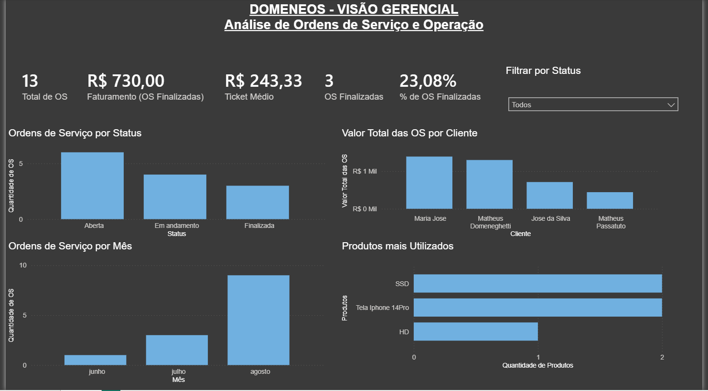

# 📊 DomeneOS - Data Analysis

Projeto de análise de dados desenvolvido a partir do **DomeneOS**, um sistema de gerenciamento de assistência técnica desenvolvido por mim.

O objetivo deste projeto é transformar os dados operacionais das ordens de serviço em informações gerenciais, permitindo acompanhar indicadores de desempenho, clientes, faturamento e utilização de produtos.

## 🛠️ Tecnologias utilizadas

* **SQL Server** — armazenamento e consulta dos dados
* **SQL** — extração e análise das informações
* **Power Query** — tratamento e transformação dos dados
* **Power BI** — modelagem, criação de indicadores e visualização dos dados
* **DAX** — criação de medidas e KPIs

## 🔄 Fluxo dos dados

**DomeneOS → SQL Server → SQL → Power Query → Power BI → Dashboard Gerencial**

Os dados são originados no banco de dados do DomeneOS e utilizados para construção das análises e indicadores apresentados no dashboard.

## 📈 Indicadores analisados

O dashboard apresenta informações como:

* Total de Ordens de Serviço
* Faturamento de Ordens de Serviço finalizadas
* Ticket médio
* Quantidade de Ordens de Serviço finalizadas
* Taxa de finalização
* Distribuição das OS por status
* Evolução das Ordens de Serviço por mês
* Valor total das OS por cliente
* Produtos mais utilizados

## 📊 Dashboard

## 🗄️ Análises SQL

Foram utilizadas consultas SQL para extrair e analisar informações do banco de dados, incluindo:

* Agrupamento de Ordens de Serviço por status
* Quantidade de Ordens de Serviço por período
* Valores de Ordens de Serviço por cliente
* Identificação dos produtos mais utilizados
* Relacionamento entre clientes e Ordens de Serviço

## 🎯 Objetivo do projeto

Além da construção do dashboard, o projeto tem como objetivo aplicar conceitos utilizados no dia a dia de **Análise de Dados e Business Intelligence**, passando pelas etapas de extração, tratamento, análise e visualização dos dados.

O projeto também demonstra a integração entre desenvolvimento de sistemas e análise de dados, utilizando como fonte uma aplicação desenvolvida por mim.
